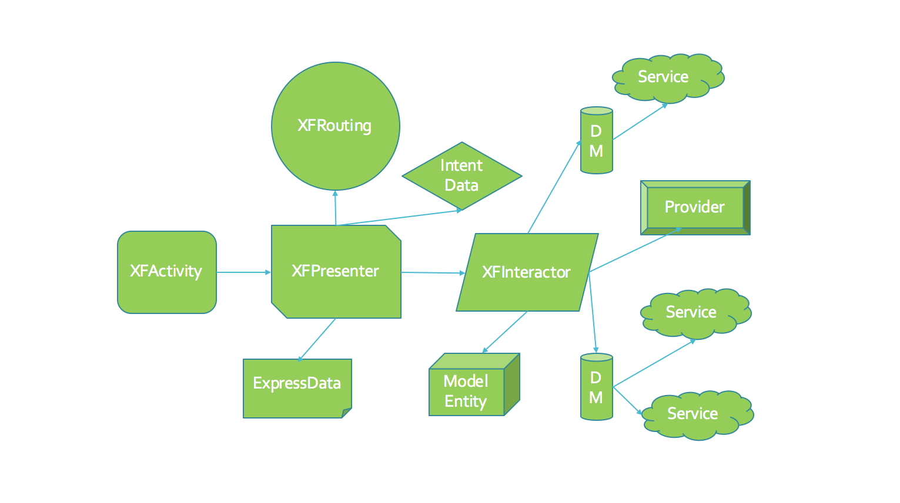

    

  
  
  
  

## Note
A lightweight framework base on VIPER architecture for IOS, to build robust and maintained large scale project.

🍺Thanks VIPER!

	

## Example
### Demo

    

### Complete project
> come soon:)

## Video
* [XFLegoVIPER Framework Introduce](https://pan.baidu.com/s/1mhZHRQC)

## Requirements
* Xcode 7.0+
* IOS 6.0+

## Installation
### CocoaPods
> pod 'XFLegoVIPER'

### Manual
Copy all files under `~/XFLegoVIPER` folder  to your project.

## Feture
* Assemble a module as fast so far, only need one line code.
* Build-In powerful module event communication.
* Real-Time track Rouing link.
* Can combine popular `ReactiveCocoa` library work together seamless.
* Consider module and controller as component, using the same transition API.
* Compatible with old project that build of MVx pattern, and help transition to VIPER pattern.
* Make project more clearly, testable, maintainable, reconfigurable.

## Blueprint

## Document
[1.5.x(中文)](./README1_5_x.md) | 2.x

## Reference
[iOS Architecture Patterns](http://www.tuicool.com/articles/rI7ZNn)

[Architecting iOS Apps with VIPER](https://objccn.io/issue-13-5/)

## Author
yizzuide, fu837014586@163.com

## License
XFLegoVIPER is available under the MIT license. See the LICENSE file for more info.

